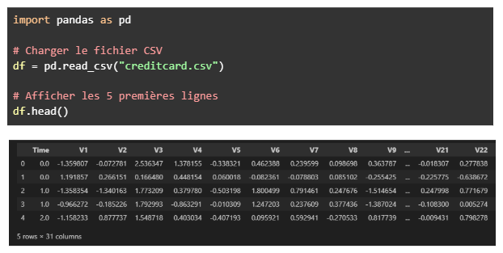
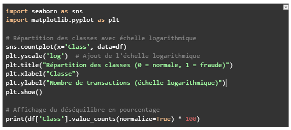
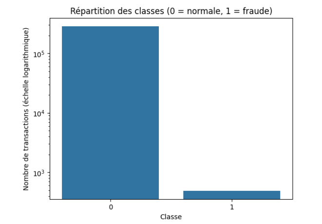
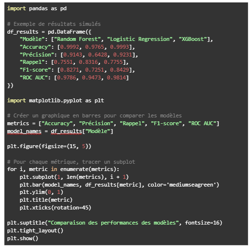
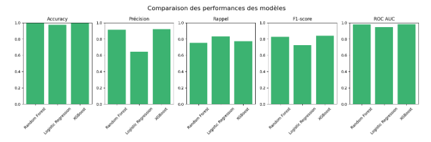
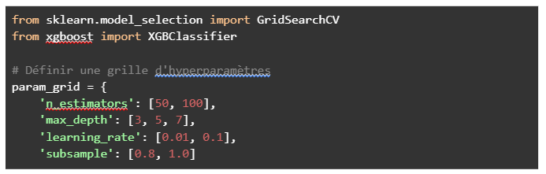
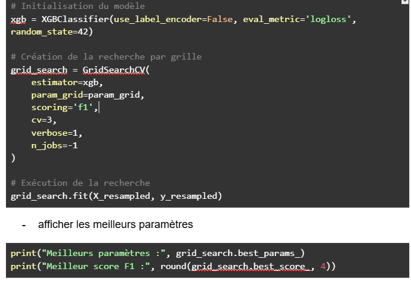
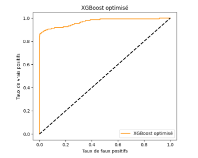

# AI Bank Fraud Detection

## Présentation du projet
Étude complète sur la **détection de fraude bancaire** via Machine Learning.
L'objectif est de montrer la chaîne de valeur complète : du code brut à l'impact financier.

---

##  1. Exploration des données
Chargement du dataset de 284 000 transactions et premières analyses via Pandas.

---

##  2. Analyse du déséquilibre 
Le défi majeur de ce projet est le déséquilibre extrême des classes (0.17% de fraudes). J'ai utilisé `seaborn` pour visualiser cette disparité critique.

---

##  3. Comparaison des modèles 
J'ai développé un script pour comparer 3 algorithmes (**Random Forest, Logistic Regression, XGBoost**) sur 5 métriques clés.

---

##  4. Optimisation avancée (GridSearchCV)
Pour maximiser la performance du modèle gagnant (XGBoost), j'ai codé une recherche par grille pour trouver les meilleurs hyperparamètres (`learning_rate`, `max_depth`, `n_estimators`).

---

##  5. Performance finale
Le modèle optimisé atteint une capacité de discrimination quasi-parfaite.

** Résultat Final (Courbe ROC) :**
L'AUC de **0.97** prouve la robustesse du modèle.

---

##  6. Impact financier (ROI)
Estimation pour une banque traitant 200 000 transactions/jour :

* **Pertes évitées (Fraudes bloquées) :** ~41.3 M€ / an.
* **Économie nette estimée :** **~37.7 Millions € par an**.
